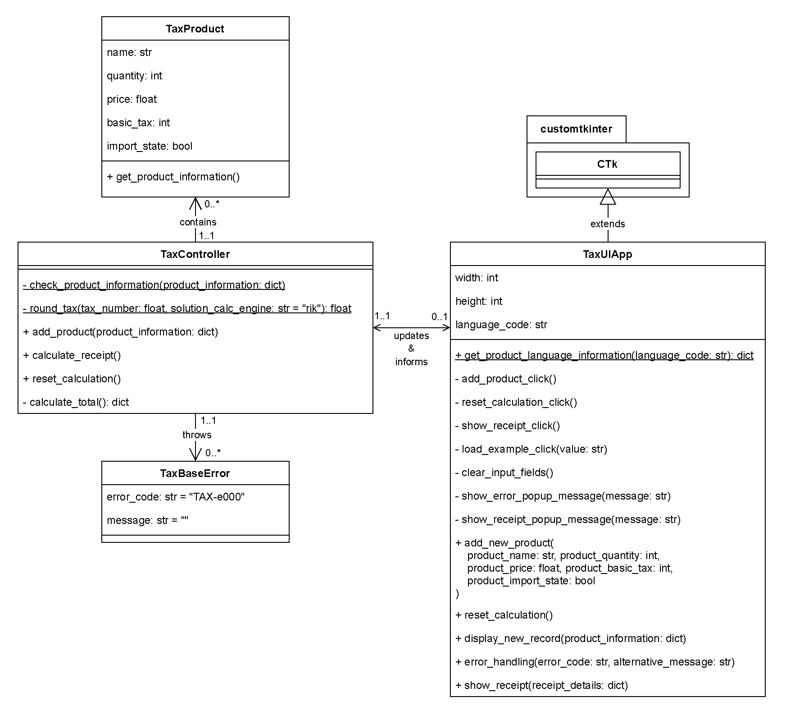

# Project 'TaXCalC' for Itemis

This project arose from an Itemis challenge and began on December 28, 2022, at 5.45 p.m.
This readme 'documentation' clarifies how the challenge was addressed and why certain assumptions were made.

## I. Constrains by Itemis
Itemis first established six constraints for the challenge:
1. Use a GitHub git repository for code distribution
2. Send an email with the link or zip file to the local git repository
3. Focus on code quality and create production-ready code
4. Work in a test-driven style
5. Commit changes
6. Mark assumptions made

## II. Challenge description
Given the [constraints](#i-constrains-by-itemis), the following challenge needed to be solved:

> ## Problem 1: SALES TAXES
> Basic sales tax is applicable at a rate of 10% on all goods, except books, food, and medical products that are exempt.
> Import duty is an additional sales tax  applicable on all imported goods at a rate of 5%, with no exemptions.
> When I purchase items I receive a receipt which lists the name of all the items and their price (including tax),
> finishing with the total cost of the items, and the total amounts of sales taxes paid.
> The rounding rules for sales tax are that for a tax rate of n%, a shelf price of p contains
> (np/100 rounded up to the nearest 0.05) amount of sales tax.
>
> Write an application that prints out the receipt details for these shopping baskets...
> 
> ### INPUT:
> 
> #### Input 1:
> - 1 book at 12.49
> - 1 music CD at 14.99
> - 1 chocolate bar at 0.85
> 
> #### Input 2:
> - 1 imported box of chocolates at 10.00
> - 1 imported bottle of perfume at 47.50
> 
> #### Input 3:
> - 1 imported bottle of perfume at 27.99
> - 1 bottle of perfume at 18.99
> - 1 packet of headache pills at 9.75
> - 1 box of imported chocolates at 11.25
>
> ### OUTPUT:
> 
> #### Output 1:
> - 1 book: 12.49
> - 1 music CD: 16.49
> - 1 chocolate bar: 0.85
> - Sales Taxes: 1.50
> - Total: 29.83
> 
> #### Output 2:
> - 1 imported box of chocolates: 10.50
> - 1 imported bottle of perfume: 54.65
> - Sales Taxes: 7.65
> - Total: 65.15
> #### Output 3:
> - 1 imported bottle of perfume: 32.19
> - 1 bottle of perfume: 20.89
> - 1 packet of headache pills: 9.75
> - 1 imported box of chocolates: 11.85
> - Sales Taxes: 6.70
> - Total: 74.68

## III. Requirements
Based on the challenge description in [chapter II.](#ii-challenge-description), the requirements of TaXCalC must be
identified in order to implement the correct software product. For the requirement specification, the template
provided by Pohl and Rupp [\[1, pp. 71–75\]](#a-bibliography) is used.

| REQ ID | Requirements Specification | Source
| ------- | -------------------------- | ------
| REQ 1 | The SYSTEM SHALL define a product (object) with the following required attributes: 'name', 'quantity', 'price', 'basic_tax', and 'import_state' | Assumption based on the input [\[Itemis challenge description, INPUT section 4\]](#ii-challenge-description)
| REQ 2 | The SYSTEM SHALL define a receipt <del>(object)</del> with the following required attributes: 'list of product objects (see [REQ 1](#iii-requirements))', 'sales taxes', and 'total' | Assumption based on the input [\[Itemis challenge description, INPUT section 4\]](#ii-challenge-description)
| REQ 3 | The SYSTEM SHALL calculate the sales tax of a product for the receipt <del>(object)</del> (see [REQ 2](#iii-requirements)) with the following formula: `n*p/100`; for a tax rate of `n%` and a price of `p` | "The rounding rules for sales tax are that for a tax rate of n%, a shelf price of p contains (np/100 rounded up to the nearest 0.05) amount of sales tax." [\[Itemis challenge description, sentence 4\]](#ii-challenge-description)
| REQ 4 | The SYSTEM SHALL round a product's sales tax up to the nearest 0.05 | "\[...\](np/100 rounded up to the nearest 0.05) amount of sales tax." [\[Itemis challenge description, sentence 4\]](#ii-challenge-description)
| REQ 4.1 | Based on [REQ 4](#iii-requirements), the SYSTEM SHOULD only include three decimal places for the rounding calculation; even if this would led to zero taxes* | Assumption based on [REQ 4](#iii-requirements)
| REQ 5 | The SYSTEM SHALL PROVIDE the user WITH THE ABILITY to add new products (see [REQ 1](#iii-requirements)) with their required attributes via a UI | Assumption based on the input [\[Itemis challenge description, INPUT section 4\]](#ii-challenge-description)
| REQ 5.1 | Based on [REQ 5](#iii-requirements) and [REQ 1](#iii-requirements), the SYSTEM SHALL check if a new added product has a string 'name' with at least 1 character and a maximum of 50; otherwise, it SHOULD throw an error and inform the user | Assumption based on [REQ 1](#iii-requirements) and [REQ 5](#iii-requirements)
| REQ 5.2 | Based on [REQ 5](#iii-requirements) and [REQ 1](#iii-requirements), the SYSTEM SHALL check if a new added product has an integer 'quantity' greater than 0 and less than 99; otherwise, it SHOULD throw an error and inform the user | Assumption based on [REQ 1](#iii-requirements) and [REQ 5](#iii-requirements)
| REQ 5.3 | Based on [REQ 5](#iii-requirements) and [REQ 1](#iii-requirements), the SYSTEM SHALL check if a new added product has a float 'price' greater than 0 and less then 1e+16; otherwise, it SHOULD throw an error and inform the user | Assumption based on [REQ 1](#iii-requirements) and [REQ 5](#iii-requirements)
| REQ 5.4 | Based on [REQ 5](#iii-requirements) and [REQ 1](#iii-requirements), the SYSTEM SHALL check if a new added product has a integer 'basic tax' which can only be 0 (0%), or 10 (10%); otherwise, it SHOULD throw an error and inform the user | "Basic sales tax is applicable at a rate of 10% on all goods, except books, food, and medical products that are exempt." [\[Itemis challenge description, sentence 1\]](#ii-challenge-description)
| REQ 5.5 | Based on [REQ 5](#iii-requirements) and [REQ 1](#iii-requirements), the SYSTEM SHALL check if a new added product has a boolean 'import state' which indicates if a product is imported and requires an import duty; otherwise, it SHOULD throw an error and inform the user | "Import duty is an additional sales tax applicable on all imported goods at a rate of 5%, with no exemptions." [\[Itemis challenge description, sentence 2\]](#ii-challenge-description)
| ~~REQ 6~~ | <del>The SYSTEM SHOULD PROVIDE the user WITH THE ABILITY to add a new product via the UI by using this format: `<quantity> <imported IF import state ELSE ''> <product name> at <price>~~`</del> | <del>e.g. "1 imported bottle of perfume at 27.99" [\[Itemis challenge description, INPUT section\]](#ii-challenge-description)</del>
| REQ 7 | The SYSTEM SHALL PROVIDE the user WITH THE ABILITY to see the receipt, which lists the name of all items and their single taxed price | "When I purchase items I receive a receipt which lists the name of all the items and their price (including tax) \[...\]" [\[Itemis challenge description, sentence 3\]](#ii-challenge-description)
| REQ 7.1 | Based on [REQ 7](#iii-requirements), the SYSTEM SHALL PROVIDE the user WITH THE ABILITY to see 'the name of all items and their single taxed price' in the format: `<quantity> <imported IF import state ELSE ''> <product name>: <taxed price>` | e.g. "1 packet of headache pills: 9.75" [\[Itemis challenge description, OUTPUT section\]](#ii-challenge-description)
| REQ 8 | The SYSTEM SHALL PROVIDE the user WITH THE ABILITY to see the receipt which lists, besides [REQ 7](#iii-requirements), the total amount of sales taxes, and the total cost of the items | "\[...\] finishing with the total cost of the items, and the total amounts of sales taxes paid." [\[Itemis challenge description, sentence 3\]](#ii-challenge-description)
| REQ 8.1 | Based on [REQ 8](#iii-requirements), the SYSTEM SHALL PROVIDE the user WITH THE ABILITY to see 'the total amount of sales taxes' in the format: `Sales Taxes: <sales tax>` | e.g. "Sales Taxes: 6.70" [\[Itemis challenge description, Output Section\]](#ii-challenge-description)
| REQ 8.2 | Based on [REQ 8](#iii-requirements), the SYSTEM SHALL PROVIDE the user WITH THE ABILITY to see 'the total cost of the items' in the format: `Total: <receipt total>` | e.g. "Total: 74.68" [\[Itemis challenge description, Output Section\]](#ii-challenge-description)

*For example, a sheet of paper would cost 0.05 and have a tax rate of 10%.<br>
Calculation: `0.05 * 0.15 = 0.0075` <br>
With REQ 4.1: `0.0075 == 0.00 =ROUNDING=> 0.0`<br>
Without REQ 4.1: `0.0075 == 0.008 = 0.01 =ROUNDING=> 0.05`

## IV. Architectural Design



## V. Implementation

The software is written in [Python](https://www.python.org/) 3.10.9. As guidance, the UML class diagram, illustrated in
the [previous chapter](#iv-architectural-design), is used for the software's architectural design. For each class,
a new Python file is created, reflecting the object's content in the UML. Additionally, the following libraries are used
in the project to improve the usability and testing experience:

| Library | Description | Documentation | PyPI Package | Version (used)
| ------- | --------- | ---- | --- | ---
| PyTest | Framework for writing readable Python tests | [PyTest - Doc 7.2.X](https://docs.pytest.org/en/7.2.x/) | [PyPI - pytest](https://pypi.org/project/pytest/) | 7.2.0
| customTkinter | Modern and customizable Python UI-library based on Tkinter | [GitHub - CustomTkinter Wiki](https://github.com/TomSchimansky/CustomTkinter/wiki) | [PyPI - customtkinter](https://pypi.org/project/customtkinter/) | 5.0.1
| Tkinter | Standard Python interface to the Tcl/Tk GUI toolkit | [Python Doc - tkinter](https://docs.python.org/3.10/library/tkinter.html) | - | Python 3.10.9 (built-in)
| ABC | Module to define an abstract base class in Python | [Python Doc - abc](https://docs.python.org/3.10/library/abc.html) | - | Python 3.10.9 (built-in)

## VI. Testing

Because the challenge aims at the tax calculation procedure, the corresponding method is focused on the testing section.
For unit testing, there are numerous approaches and tools available, each with its own set of pros and cons. To generate
unit test cases for this project, the well-known analysis of equivalence classes and the Boundary Value Analysis are employed.
Furthermore, each conceivable path, and hence each line of source code, should be covered at least once with a test case run. As
unit testing library for Python, [PyTest](https://docs.pytest.org/en/7.2.x/) is used to execute the following defined test cases:

| T. ID | Description | Goal
| ------- | --------- | ----
| T 1 | Test if a product with the attributes 'name', 'quantity', 'price', 'basic_tax', and 'import_state' can be created | Functionality Check 
| T 2 | Based on [T 1](#vi-testing), determine if the getter of the product attribute information returns the information in a dictionary (map) | Functionality Check
| T 3 | Test if a product name with only 0 or more than 50 characters throws an error | Error Coverage
| T 4 | Test if a product quantity of 0 or more than 99 throws an error | Error Coverage
| T 5 | Test if a negative product price or greater than or equal to 1e+16 throws an error | Error Coverage
| T 6 | Test if a product's basic tax rate, besides 0(%) and 10(%) throws an error | Error Coverage
| T 7 | For 0.00 to 0.09, test the rounding method | Functionality Check
| T 8 | Test if a product will be added to a list of products| Functionality Check
| T 9 | Test the calculation method | Functionality Check
| T 10 | Test if the method for calculating the receipt uses the method for calculating the total | Functionality Check
| T 11 | Test if the method for resetting the calculation deletes all added products | Functionality Check

Note:<br>
The UI will not have test cases, and only the developer, acting as a possible user, will go through
many walkthroughs of the software.

## VII. Installation (Try it yourself!)

As described in [chapter V](#v-implementation), the software is written in Python and does not
include a PyInstaller application to execute. To run and test the software (with tests) on your own,
perform the following steps:
1. Clone the GitHub 'main' repository, or download and unpack the files
   - Tutorial: [GitHub - 'Cloning a repository'](https://docs.github.com/en/repositories/creating-and-managing-repositories/cloning-a-repository)
2. Download the Python interpreter for your operating system if you do not already have Python or a matching virtual environment installed
   - Download Overview: [Python - 'Downloads'](https://www.python.org/downloads/)
   - Download Python Version 3.10: [Python - 'Version 3.10'](https://www.python.org/downloads/release/python-3109/)
4. Before running the software, the (not built-in) packages mentioned in [chapter V](#v-implementation) must be installed using the Python package installer [pip](https://pypi.org/project/pip/)
   - If you want, you can <b>update pip</b> with: `python -m pip install --upgrade pip`
     - If the python var is not globally available in your shell, cmd, or powershell, either add it or execute the command in the python installation location
   - Install all packages defined in the <b>requirements.txt</b> with: `pip install -r requirements.txt`
     - The default location of the requirements.txt file is in the root of the repository
     - Don't forget to execute the shell, cmd, or powershell in the directory or change the path to `<project-path>\requirements.txt!`
5. To run the software, execute the <b>main.py</b> Python file in: `<project-path>\taxcalc`
6. For experts, you can change the language of the UI by changing the `language_code` parameter to a supported ISO 639 language code
     ```python
     [...] 
      if __name__ == "__main__":
          # Crate new UI Instance
          tax_ui_app = TaxUIApp(width=780, height=590, language_code="eng")
     [...] 
     ```
   - English -> language_code=`"eng"`
   - German -> language_code=`"de"`
7. For experts, you can run the <b>tests</b> after installing [PyTest](https://docs.pytest.org/en/7.2.x/) by executing `pytest` for / in the test directory

## A. Bibliography
1. Klaus Pohl and Chris Rupp, "Basiswissen Requirements Engineering: Ausund Weiterbildung nach IREB-Standard zum
Certified Professional for Requirements Engineering Foundation Level", in 5th ed., ser. iSQI-Reihe.
Heidelberg, Germany: dpunkt.verlag, 2021.